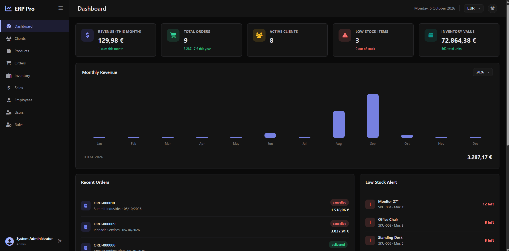
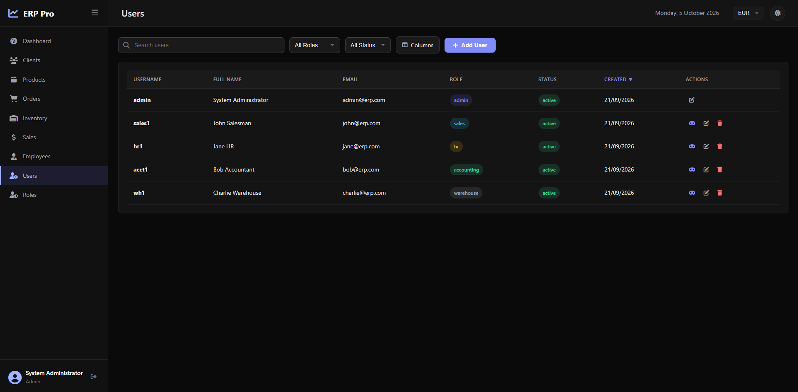
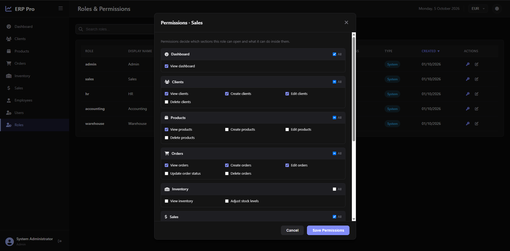
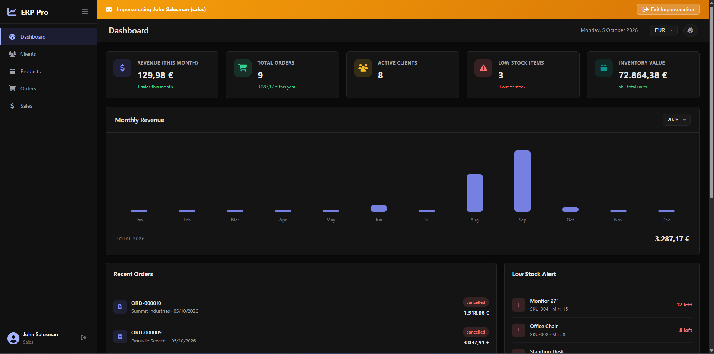

# ERP Pro — Business Management System

A full-stack ERP/CRM application for small businesses, covering clients, products, orders, inventory, sales, employees, and access control. Built on Node.js with a zero-build vanilla JS frontend — `npm install`, migrate, and run.



## Tech Stack

| Layer | Technology |
|-------|-----------|
| Backend | Node.js + Express 4 |
| Database | SQLite (sql.js — WebAssembly, file-persisted) |
| Frontend | Vanilla HTML/CSS/JS SPA (native ES modules, no bundler) |
| Auth | JWT (24h) + bcrypt (12 rounds) |
| Security | Helmet, CORS, rate limiting, parameterized queries |

## Quick Start

```bash
npm install
npm run setup    # runs migrations + seeds demo data
npm start        # http://localhost:3000
```

Requires Node.js ≥ 18.11. No build step, no external database server.

### Demo Accounts

| Role | Username | Password |
|------|----------|----------|
| Admin | `admin` | `admin123` |
| Sales | `sales1` | `sales123` |
| HR | `hr1` | `hr123` |
| Accounting | `acct1` | `accounting123` |
| Warehouse | `wh1` | `warehouse123` |

### Scripts

| Command | Description |
|---------|-------------|
| `npm start` | Start the server |
| `npm run dev` | Start with auto-reload (`node --watch`) |
| `npm run setup` | Migrate + seed |
| `npm run migrate` / `:rollback` / `:status` | Manage migrations |
| `npm run seed` | Seed demo data |

## Features

**9 modules:** Dashboard, Clients, Products, Orders, Inventory, Sales, Employees, Users, Roles — 62 REST endpoints, all with search, filtering, sorting, and pagination.

- **Dashboard** — revenue chart, KPI cards, recent orders, low-stock alerts
- **Clients / Products / Orders / Inventory / Sales / Employees** — full CRUD, order line items, status tracking, automatic inventory deduction on sale
- **Users** — user management with role assignment
- **Roles & Permissions** — granular, per-module permission grants
- **UI** — dark mode, USD/EUR currency and locale switch, sortable columns

### Screenshots

**User management** — search, filter by role/status, create, edit, delete:



**Role management** — permissions are grouped per module and granted per action (view / create / edit / delete). Every API route and sidebar item is checked against them:



**User impersonation** — admins can log in *as* any user to reproduce exactly what they see. A banner stays visible until impersonation is exited, and the original session is restored:



### Access Control

Five seeded roles (`admin`, `sales`, `hr`, `accounting`, `warehouse`) come with sensible defaults across 33 permission keys; custom roles can be granted any combination. Guards built in:

- System roles cannot be renamed or deleted
- A role with assigned users cannot be deleted
- You cannot delete your own role or strip it of `roles.view` / `roles.update`
- Role changes apply immediately, no re-login required

### Security

JWT authentication, bcrypt password hashing, rate limiting on API and login endpoints, Helmet security headers, parameterized SQL queries, and input validation on every endpoint.

## Project Structure

```
config/         database, permissions, seed, migration runner + migrations/
controllers/    11 controllers (auth, CRUD modules, dashboard)
models/         8 models
routes/         11 route files mounted under /api/*
middleware/     JWT auth + requirePermission
public/         SPA (index.html, css/, js/ modules)
data/           SQLite file (auto-created, gitignored)
server.js       Express entry point
```

## Environment Variables

Create a `.env` in the project root:

```
PORT=3000
JWT_SECRET=your_secret_key
DB_PATH=./data/erp.db
NODE_ENV=development
```

## Migrations

Migrations are numbered JS files in `config/migrations/` exporting `up` and `down` SQL strings.

```bash
npm run migrate:status   # check state
npm run migrate          # apply pending
npm run migrate:rollback # revert last
```

To add one: create `config/migrations/003_your_change.js`, export `up`/`down`, then run `npm run migrate`.
